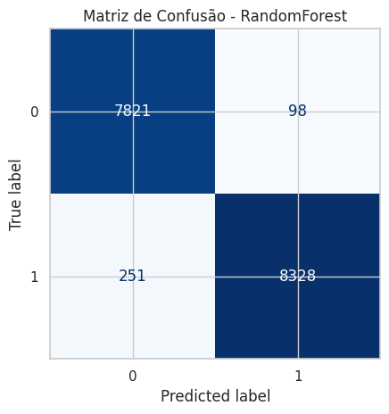
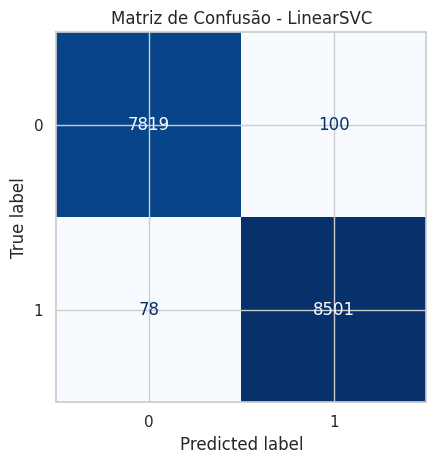
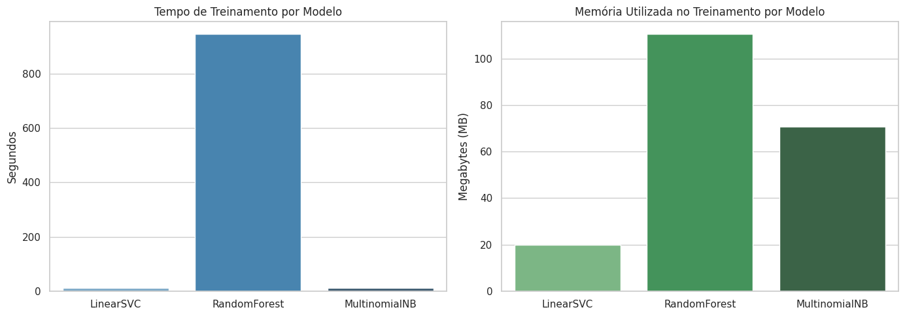

#  Detecção de Phishing com Machine Learning


>  **Trabalho de Conclusão de Curso (TCC)** apresentado à **Universidade Federal do Ceará (UFC)** como requisito para conclusão do curso de **Segurança da Informação**.

**Autor:** Tiago Andrade
**Ano:** 2025

---

##  Sobre o projeto

E-mails de phishing continuam sendo uma das portas de entrada mais comuns para ataques cibernéticos, explorando engenharia social para roubo de credenciais e dados sensíveis. Este projeto investiga a **viabilidade do uso de Machine Learning para detecção automática de e-mails de phishing**, aplicando técnicas de Processamento de Linguagem Natural (NLP) para transformar texto em características computáveis, e comparando o desempenho de diferentes algoritmos de classificação — tanto em métricas preditivas quanto em custo computacional.

O trabalho segue metodologia científica: pré-processamento de texto, validação cruzada estratificada com intervalos de confiança, e análise comparativa de tempo e memória entre os modelos.

---

##  Objetivo

Detectar automaticamente e-mails de phishing utilizando **Processamento de Linguagem Natural (NLP)** e **Aprendizado de Máquina**, comparando diferentes algoritmos de classificação quanto à qualidade das predições e à eficiência computacional.

---

##  Técnicas utilizadas

- Processamento de Linguagem Natural (NLP)
- TF-IDF (Term Frequency–Inverse Document Frequency)
- Validação Cruzada Estratificada (5 folds) com intervalo de confiança de 95%
- Análise Exploratória de Dados
- Métricas de desempenho: Acurácia, Precisão, Recall e F1-Score
- Análise de desempenho computacional (tempo de execução e uso de memória)

##  Modelos avaliados

| Modelo | Biblioteca |
|---|---|
| Multinomial Naive Bayes | `sklearn.naive_bayes.MultinomialNB` |
| Support Vector Machine | `sklearn.svm.LinearSVC` |
| Random Forest Classifier | `sklearn.ensemble.RandomForestClassifier` |

##  Tecnologias

Python · Pandas · NumPy · Scikit-learn · SpaCy · Matplotlib · Seaborn · TQDM · PSUtil · SciPy

---

##  Estrutura do projeto

```
tcc-deteccao-phishing-machine-learning/
├── src/
│   ├── __init__.py
│   ├── data_loading.py      # carregamento e exploração inicial do dataset
│   ├── preprocessing.py     # limpeza de texto, NLP e lematização
│   ├── eda.py                # análise exploratória e frequência de palavras
│   ├── models.py             # definição dos pipelines de classificação
│   ├── evaluation.py         # validação cruzada e comparação de métricas
│   └── performance.py        # avaliação de tempo e memória
├── results/                  # gráficos gerados pela execução do projeto
├── main.py                   # ponto de entrada: orquestra o pipeline completo
├── requirements.txt
├── .gitignore
├── LICENSE
└── README.md
```

---

##  Como executar o projeto

### 1. Clonar o repositório
```bash
git clone https://github.com/TiagoACTR/tcc-deteccao-phishing-machine-learning.git
cd tcc-deteccao-phishing-machine-learning
```

### 2. Instalar as dependências
```bash
pip install -r requirements.txt
python -m spacy download en_core_web_sm
```

### 3. Baixar o dataset
Baixe o `phishing_email.csv` a partir do link na seção [Dataset](#-dataset) e coloque dentro de uma pasta `data/` na raiz do projeto.

### 4. Executar
```bash
python main.py
```

---

##  Resultados

Os modelos foram avaliados por meio de validação cruzada estratificada (5 folds), comparados pelas métricas de Acurácia, Precisão, Recall e F1-Score, com intervalo de confiança de 95%.






Também foi avaliado o desempenho computacional de cada modelo — tempo de treinamento e consumo de memória:



---

##  Dataset

O dataset utilizado neste projeto é público e está disponível no Kaggle:

🔗 **[phishing-email-dataset](https://www.kaggle.com/datasets/naserabdullahalam/phishing-email-dataset)**

Por questões de tamanho (acima de 25 MB), o arquivo CSV não está incluído diretamente no repositório.

| Informação | Detalhe |
|---|---|
| Origem | Kaggle |
| Autor | Naser Abdullah Alam |
| Licença | CC BY-SA 4.0 |
| Formato | CSV |
| Classes | E-mails legítimos e e-mails de phishing |

---

##  Licença

Este projeto está licenciado sob a licença **MIT**. Veja o arquivo [LICENSE](LICENSE) para mais detalhes.
